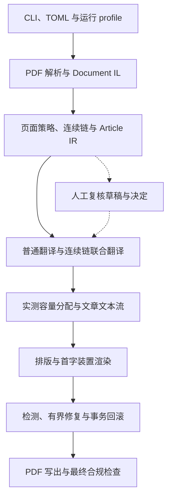

# BabelDOC Magazine

BabelDOC Magazine 是基于 [funstory-ai/BabelDOC](https://github.com/funstory-ai/BabelDOC) 0.6.4 扩展的杂志 PDF 版式保持翻译研究原型。项目面向原生数字 PDF，在固定页数、可检索文本和视觉资产保护的约束下，研究文章级上下文翻译、跨栏与跨页文本流、首字装置和可审计修复。

当前主评估方向为英文到中文。中文到英文已接入同一运行链，仍处于探索性验证阶段。输出适合研究对比、演示和低成本在线多语阅读试验；正式出版前需要人工校对与版面复核。

## 当前状态

| 项目 | 状态 |
| --- | --- |
| 统一命令入口 | 已有：`babeldoc` / `uv run babeldoc` |
| 杂志运行入口 | 已有：`--magazine-profile <profile.json>` |
| 随仓库提供的 profile | 保守配置，只启用完整功能链的一部分 |
| 完整功能一键模式 | 尚未提供 |
| 推荐运行形态 | 从本仓库源码目录执行 |
| Python | `>=3.10,<3.14` |
| 翻译服务 | OpenAI 兼容接口 |
| 主要输入 | 带文本层的原生数字 PDF |
| 明确边界 | 不实现同页多文章身份隔离；扫描件不属于主研究范围 |

完整启动模式、资源打包和短门禁的收口工作见 [`plans/codex_plan_C16.md`](plans/codex_plan_C16.md)。

## 核心能力

- 通过页面类型、连续链和 `ArticleDocumentIR` 建立跨页文章状态。
- 将同一连续链执行一次联合翻译，再按实测容量重新分配到原有栏位。
- 在同一文章区域内执行有边界的跨栏、相邻跨页文本回填。
- 对图片、表格、公式和受保护文本建立固定资产清单与几何守卫。
- 使用 `RunTrace` 连接源元素、文章、翻译请求、目标片段、修复代次和最终几何。
- 支持人工复核草稿与决定文件，覆盖术语、页面类型和首字装置。
- 分别实现英文凸起首字母与中文两行首字装置，并记录源颜色与几何证据。
- 在写出 PDF 前执行检测和有界修复，在写出后重新打开 PDF 执行合规检查。

## 设计边界

项目遵守以下版面约束：

- 输出页数保持不变，不通过新增页面解决溢出。
- 正文翻译保持为可检索文本。
- 图片、表格、公式、页眉页脚等固定视觉资产不能随文章文本流漂移。
- 跨页重排仅在已确认属于同一文章的相邻页面之间进行。
- 同页多文章身份隔离没有实现。此类页面会进入受限路径或记录为不支持状态。
- 扫描件检测仍保留上游能力，OCR 版面恢复不属于本扩展的主要目标。
- 检测与修复采用确定性规则、有限动作集合、单调验收和原子回滚。

## 架构



### 主要模块

| 路径 | 职责 |
| --- | --- |
| `babeldoc/main.py` | 命令行解析、翻译器和布局模型初始化、单文件或多文件调度 |
| `babeldoc/format/pdf/high_level.py` | PDF 到 IL、翻译、排版、写出和最终合规检查的总流水线 |
| `babeldoc/format/pdf/document_il/` | 上游 Document IL、解析中间件和排版实现 |
| `babeldoc/format/pdf/document_il/midend/il_translator_llm_only.py` | 当前 LLM 翻译主路径；接入文章上下文、连续链和运行追踪 |
| `babeldoc/magazine/runtime_profile.py` | 严格加载 22 个功能开关、校验依赖并写运行清单 |
| `babeldoc/magazine/page_classifier.py` | 页面类型识别及页面策略证据 |
| `babeldoc/magazine/chain_builder.py` | 跨栏、跨页连续链检测 |
| `babeldoc/magazine/article_builder.py`、`article_ir.py` | 构建稳定文章标识、区域槽位和跨页索引 |
| `babeldoc/magazine/article_context.py` | 从规范文章状态构建文章级翻译上下文 |
| `babeldoc/magazine/chain_translation.py` | 连续链一次联合翻译、失败状态和守恒记录 |
| `babeldoc/magazine/chain_backfill.py` | 按实测排版容量分配联合译文 |
| `babeldoc/magazine/article_flow.py` | 文章内跨栏文本流与事务提交 |
| `babeldoc/magazine/cross_page_reflow.py` | 相邻页面间的受限文章文本流 |
| `babeldoc/magazine/fixed_assets.py` | 固定资产识别、摘要与漂移检查 |
| `babeldoc/magazine/run_trace.py` | 源元素到最终几何的运行内追踪和守恒验证 |
| `babeldoc/magazine/drop_cap*.py` | 首字候选、语言策略、颜色继承、几何渲染和回滚守卫 |
| `babeldoc/magazine/detectors/` | 越界、碰撞、残留、资产漂移、所有权和守恒检查 |
| `babeldoc/magazine/transaction.py`、`acceptance.py` | 修复快照、原子回滚和单调验收 |
| `babeldoc/magazine/hitl.py` | 人工复核草稿导出、决定文件校验与应用 |
| `babeldoc/magazine/final_pdf_validator.py` | 重新打开最终 PDF，检查页数、文本、几何、资产和首字装置 |
| `configs/` | 页面策略、阈值、动作集合、profile 与合规规则 |
| `prompts/` | 版本化提示模板；运行时写入模板摘要清单 |
| `spec_checks/` | 批次规格检查与语料门禁 |

### 运行顺序

1. `runtime_profile` 在创建 IL 前加载 profile、校验开关依赖，并写入 `magazine_run_manifest.json`。
2. 上游解析器生成 Document IL，完成布局、段落、样式和公式处理。
3. 杂志扩展依次执行公式重分类、页面分类、连续链检测和文章归并。
4. `ArticleBuilder` 生成规范 `ArticleDocumentIR`，`RunTrace` 从该状态建立源记录。
5. 自动术语抽取和人工复核决定在翻译器创建前生效。
6. 普通段落进入 LLM-only 翻译路径；已确认连续链可进入一次联合翻译路径。
7. 译文按实测容量回填，在文章区域内执行跨栏和受限跨页文本流。
8. 排版完成后渲染首字装置，再运行确定性检测和已启用的修复动作。
9. PDF 写出后由最终验证器重新打开，生成合规状态，并把结果绑定回 `RunTrace`。

## 安装

### 前置条件

- Git
- [uv](https://docs.astral.sh/uv/)
- Python 3.10、3.11、3.12 或 3.13
- 可访问的 OpenAI 兼容接口及对应 API key

当前 wheel 不包含根目录的 `configs/` 与 `prompts/`。请使用源码检出方式运行杂志扩展。

```bash
git clone https://github.com/Azphire/BabelDOC.git
cd BabelDOC
uv sync
```

首次运行前下载并校验布局模型与字体资源：

```bash
uv run babeldoc --warmup
```

仓库没有提交 `uv.lock`，`uv sync` 会按执行时可解析的依赖版本创建本地环境。需要严格复现实验时，应保存本次解析得到的锁文件和运行清单。

## 快速启动

### Linux / macOS

```bash
export OPENAI_API_KEY="your-api-key"

uv run babeldoc \
  --files /absolute/path/to/input.pdf \
  --openai \
  --openai-model gpt-4o-mini \
  --openai-api-key "$OPENAI_API_KEY" \
  --lang-in en \
  --lang-out zh \
  --magazine-profile configs/magazine_runtime_profile.v1.json \
  --working-dir runs/work \
  --output runs/output \
  --debug
```

### Windows PowerShell

```powershell
$env:OPENAI_API_KEY = "your-api-key"

uv run babeldoc `
  --files "C:\path\to\input.pdf" `
  --openai `
  --openai-model gpt-4o-mini `
  --openai-api-key $env:OPENAI_API_KEY `
  --lang-in en `
  --lang-out zh `
  --magazine-profile configs/magazine_runtime_profile.v1.json `
  --working-dir runs/work `
  --output runs/output `
  --debug
```

当前 CLI 不会自动读取 `OPENAI_API_KEY`。以上命令通过 shell 展开环境变量，再传给 `--openai-api-key`。避免把真实密钥写入仓库内的 TOML 或脚本。

常用调整：

- 中文到英文：`--lang-in zh --lang-out en`
- 自定义兼容接口：增加 `--openai-base-url https://host.example/v1`
- 只生成单语 PDF：增加 `--no-dual`
- 只生成双语 PDF：增加 `--no-mono`
- 限定页码：增加 `--pages 1-5,8`
- 禁用自动术语抽取：增加 `--no-auto-extract-glossary`
- 查看全部参数：`uv run babeldoc --help`

`--working-dir runs/work` 会为每个输入文件追加文件名 stem。例如 `input.pdf` 的审计文件位于 `runs/work/input/`。

### 仅解析烟雾测试

当前 CLI 会在解析专用模式下继续校验翻译服务参数。可使用不会发起翻译请求的占位值完成短烟雾测试：

```bash
uv run babeldoc \
  --files examples/ci/test.pdf \
  --only-parse-generate-pdf \
  --skip-scanned-detection \
  --openai \
  --openai-api-key parse-only-unused
```

该参数约束会在 C16 启动统一化计划中移除。

## 配置

项目有三层配置：

1. CLI 或 TOML：输入输出、语言、服务、并发和通用 PDF 选项。
2. 运行 profile：统一启用或停用杂志功能。
3. `configs/*.json` 与 `prompts/*.md`：算法阈值、封闭枚举、动作集合和提示模板。

### TOML 配置

`configargparse` 读取 `[babeldoc]` 表。建议在配置文件中保存非敏感参数，密钥继续通过命令行环境变量展开。

```toml
[babeldoc]
lang-in = "en"
lang-out = "zh"
output = "runs/output"
working-dir = "runs/work"
debug = true

openai = true
openai-model = "gpt-4o-mini"
qps = 4
pool-max-workers = 4
term-pool-max-workers = 2

magazine-profile = "configs/magazine_runtime_profile.v1.json"
watermark-output-mode = "no_watermark"
no-dual = true
skip-scanned-detection = false
auto-extract-glossary = true
```

运行：

```bash
export OPENAI_API_KEY="your-api-key"
uv run babeldoc \
  --config local.toml \
  --files /absolute/path/to/input.pdf \
  --openai-api-key "$OPENAI_API_KEY"
```

`local.toml` 当前没有被 `.gitignore` 自动排除。请勿在其中保存密钥；需要本机专用参数时，可把文件名加入 `.git/info/exclude`。

### 杂志运行 profile

`configs/magazine_runtime_profile.v1.json` 使用严格结构：

```json
{
  "format_version": 1,
  "profile": "magazine-runtime",
  "version": 1,
  "switches": {
    "magazine_checkpoint": true
  }
}
```

上例只用于展示外层结构，不能直接运行。实际 profile 必须完整声明全部 22 个布尔开关，不能包含未知键。创建自定义 profile 时，请复制仓库内完整文件后修改值。

随仓库提供的 profile 当前状态如下：

| 开关 | 默认 profile | 作用 |
| --- | --- | --- |
| `magazine_checkpoint` | 开 | 写入阶段性 XML 检查点 |
| `magazine_page_classify` | 开 | 识别页面类型并加载页面策略 |
| `magazine_chain_detect` | 开 | 检测跨栏、跨页连续链 |
| `magazine_chain_translate` | 关 | 对连续链执行一次联合翻译 |
| `magazine_article_group` | 开 | 构建规范文章状态与文章区域 |
| `magazine_article_context` | 关 | 生成文章级翻译上下文 |
| `magazine_hitl_export` | 关 | 导出人工复核草稿 |
| `magazine_hitl_apply` | 关 | 校验并应用人工决定 |
| `magazine_detect` | 开 | 执行版面与守恒检测 |
| `magazine_column_reflow` | 开 | 启用文章内跨栏及受限跨页文本流 |
| `magazine_drop_cap_mark` | 关 | 标记首字候选与意图 |
| `magazine_drop_cap_apply` | 关 | 应用语言策略或人工决定 |
| `magazine_drop_cap_render` | 关 | 渲染首字装置并执行几何守卫 |
| `magazine_formula_reclass` | 开 | 修复被公式阶段误吞的普通文本 |
| `magazine_fragment_stitch` | 开 | 合并错误拆开的正文片段 |
| `magazine_indent_policy` | 开 | 按页面与文章策略决定缩进 |
| `magazine_line_structure` | 开 | 处理声明为逐行结构的页面 |
| `magazine_paren_dedup` | 开 | 清理翻译后重复括号 |
| `magazine_repair` | 关 | 执行封闭动作集合内的有界修复 |
| `magazine_rotated_lane` | 关 | 处理修复阶段确认的旋转文本通道 |
| `magazine_title_typeset` | 开 | 应用标题专用排版策略 |
| `magazine_pdf_compliance` | 开 | 检查最终可检索 PDF |

开关之间存在显式依赖。例如联合翻译依赖连续链检测，首字渲染依赖标记与应用，旋转文本通道依赖修复，文章文本流依赖检测、检查点和文章归并。依赖不满足时，流水线会在 IL 创建前终止，并把原因写入运行清单。

该 profile 可启动统一的保守流水线。它没有启用联合翻译、文章上下文、人工复核、首字装置、修复和旋转文本通道，因此无法覆盖 15 轮开发形成的完整功能组合。

### 算法配置与提示模板

| 类别 | 代表文件 |
| --- | --- |
| 页面策略与特征 | `configs/page_types.json`、`page_features.json`、`page_types.pctl.json` |
| 文章与连续链 | `article_grouping.json`、`chain_detection.json`、`chain_translation.json`、`article_context.json` |
| 文本流与排版 | `article_flow.json`、`column_reflow.json`、`title_typeset.json`、`indent_policy.json` |
| 首字装置 | `drop_cap.json`、`drop_cap_render.json`、`initial_adjacent.json` |
| 检测与修复 | `detectors.json`、`repair_actions.json`、`repair_acceptance.json`、`decision_rounds.json` |
| 最终 PDF | `final_pdf_compliance.json`、`render_diff.json`、`metrics.json` |
| 人工复核 | `hitl.json`、`reviews/` |
| 提示模板 | `prompts/*.md` |

阈值、枚举和提示文本应继续保存在这些外部文件中。不要在代码中加入刊物名、页码、样本标识或针对单一版面的条件分支。

## 人工复核文件

启用相应 profile 开关后，`hitl.py` 使用以下文件：

| 文件 | 写入者 | 用途 |
| --- | --- | --- |
| `reviews/<stem>.review.json` | 程序 | 机器默认判断和可编辑字段的结构化草稿 |
| `reviews/<stem>.review.html` | 程序 | 便于阅读的本地审阅页面 |
| `reviews/<stem>.decisions.json` | 人工 | 术语、页面类型和首字决定 |
| `<working-dir>/<stem>/hitl_apply.report.json` | 程序 | 实际应用结果与未命中警告 |

程序不会生成带有效决定的 `decisions.json`。决定文件采用整文件校验；任一非法条目会阻止整份文件应用。当前仓库没有可直接选择的人工复核运行模式，C16 计划会补齐 export/apply 预设和显式复核目录参数。

## 运行产物与审计

启用相应功能后，工作目录会出现以下核心文件：

| 文件 | 内容 |
| --- | --- |
| `magazine_run_manifest.json` | 代码提交、输入摘要、profile 摘要、有效开关和依赖校验 |
| `magazine_config_manifest.json` | 本次读取的算法配置及摘要 |
| `prompts.manifest.json` | 本次读取的提示模板及摘要 |
| `article_ir.json` | 规范文章、区域槽位、源元素和跨页索引 |
| `chain_report.json` | 连续链成员、证据和判定 |
| `chain_translation.report.json` | 联合请求、译文和失败状态 |
| `article_flow.report.json` | 跨栏、跨页放置及事务结果 |
| `fixed_asset_inventory.report.json` | 固定资产类型、几何和摘要 |
| `run_trace.report.json` | 源、请求、片段、代次和最终几何对应 |
| `issues.json` | 确定性检测结果 |
| `drop_cap_intent.report.json` | 首字意图、语言策略和源颜色 |
| `drop_cap_render.report.json` | 首字几何、检测和回滚结果 |
| `final_pdf_compliance.json` | 最终 PDF 的 `pass`、`degraded` 或 `fail` 状态及证据 |
| `checkpoint.*.zip` | 开启检查点后保存的阶段性机器状态 |

调试 JSON 用于检查，XML 检查点是机器恢复与重放依据。运行产物可能包含文档内容或摘要，应按输入文档的保密等级保存和清理。

## 开发与短测试

安装开发依赖：

```bash
uv sync --group dev
```

推荐的短检查：

```bash
uv run python -m compileall -q babeldoc tools spec_checks
uv run ruff check .
SPEC_NO_NESTED=1 uv run python spec_checks/spec_check_pdf_compliance.py
```

`spec_checks/run_all.py` 包含历史批次的 fast 与 sweep 门禁。sweep 会重建语料输出，耗时可能达到数小时；短周期开发不要启动 sweep。

每项功能使用独立提交。代码注释保持英文、数量最少，只解释必要约束。实现继续遵守 `CLAUDE.md` 中的唯一翻译路径、外部配置、固定资产、检查点和通用化规则。

## 2026-08-26 代码质量审计

审计基线：`cda5ccc3159ee271af8ba1f978b13ec275b47b3b`。

已完成的短检查：

| 检查 | 结果 |
| --- | --- |
| `python -m compileall -q babeldoc tools spec_checks` | 通过 |
| wheel 构建 | 通过 |
| C01-C15 新增规格检查 | 14/15 通过 |
| 最终 PDF 合规规格 | 10/10 断言通过 |
| `ruff check .` | 失败，共 78 项 |
| 完整语料 sweep | 未运行，符合本次短周期限制 |

当前已知工程问题：

1. `spec_check_drop_cap_intent.py` 在中文渲染用例中失败，`drop_cap` 意图与 C14 当前决定指纹约束之间存在回归。
2. C01-C15 的 15 个规格文件没有加入 `spec_checks/run_all.py`，也没有声明 `GATE_SET`，总门禁无法覆盖这些检查。
3. 仓库没有 `batch-C*` 标签，部分规格检查的变更范围断言会回退到 `git diff HEAD`；干净提交上的结果为空，范围检查可能失去作用。
4. 当前 wheel 没有打包 `configs/` 与 `prompts/`，安装包中的杂志扩展缺少运行资源。
5. 随仓库提供的 profile 关闭 9 个关键开关，完整功能链没有统一启动预设。
6. CI 会执行 `ruff check .`，当前主分支静态检查无法通过。
7. `uv.lock` 没有纳入版本控制，依赖解析缺少仓库级锁定。
8. `pyproject.toml` 的项目链接仍指向上游仓库；`regex` 被源码直接导入，但只通过传递依赖获得。

这些结果证明代码能够编译，新增的大部分局部规格可以运行，最终 PDF 验证器的独立规格已通过。真实杂志样本的端到端稳定性、视觉质量和跨平台可重复性仍需要修复门禁后再评估。

## 上游与许可证

本项目建立在 [funstory-ai/BabelDOC](https://github.com/funstory-ai/BabelDOC) 上。上游差异和历史批次记录见 `UPSTREAM_DIFF.md`、`WAIVERS.md` 与 `plans/`。

代码按 [GNU Affero General Public License v3.0](LICENSE) 发布。使用、修改和部署前请确认符合许可证要求及输入文档的版权与保密要求。
