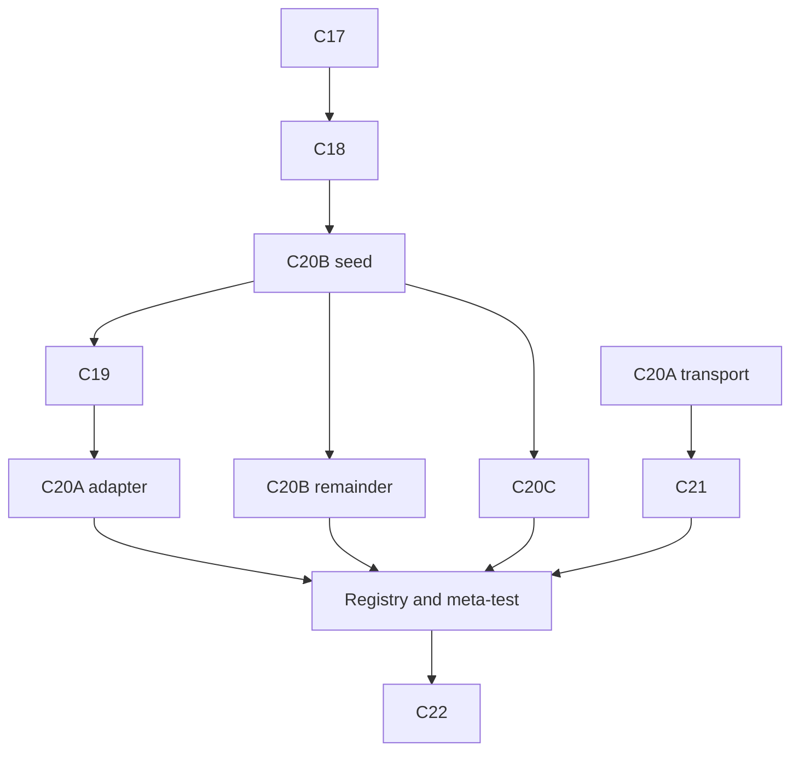

# BabelDOC C01–C16 复核、上次失败原因与48小时执行总表

版本：2026-08-26 rev.3  
用途：解释上次C计划为何“提交都存在但任务仍未完成”，删除同页多文章/多章节支持，审视并调度新的C17–C22执行文件。  
本文件只作审计与orchestration；每份执行plan均上下文自足。

## 1. 拉取结果、权威与输入状态

- 仓库：[Azphire/BabelDOC](https://github.com/Azphire/BabelDOC)。
- 最终刷新后本地`HEAD`与`origin/main`均为`57a12552da7a13523ad5a2e27b45473f24183208`，工作树干净；该提交新增中英/英中TOML并把ABB machine review更新到v3。
- 英文TeX SHA-256：`a3e7a6237085d3879ab98f53265d3fac7450d18ee8610f6eb62230c6ba67fd08`。
- ABB失败归档SHA-256：`ca2af3fe9de87089b766dd698c9f200ae3afaf668b7d676d74fbac4cec42165b`。
- Manifest所指原始`examples/input/ABB-zh.pdf`：SHA-256 `e8249e884bea2f35239f708247367105aac029e1b758d1905eda6d5f90802f97`，1276160 bytes。
- RAR内failed work input：SHA-256 `e9d0b6c7351421a0dccd06694577e498c10508e05f2ea76c6bae2b4adbd477bc`，不可替代原始输入。
- 当前审计workspace没有原始PDF；仓库已有`babeldoc.zh-en.toml`，SHA-256为`0e704cddbf26e1a0da76e55c1a0cbdebbca3b19825f2246a9434e8ec98dd7ea9`，且TOML不内嵌key。当前确定状态是`BLOCKED_PENDING_ORIGINAL_PDF`；环境credential未读取/推断，C22只检查`credential_configured`布尔值，缺失时另报`BLOCKED_PENDING_CREDENTIAL`。
- 仓库当前`reviews/ABB-zh.review.json`为machine review v3，`reviews/ABB-zh.decisions.json`仍为人工decisions v2。最新提交只重生成review，未把旧decisions绑定到新review/source；两者不能被默认为同一次review cycle。
- 拉取后只读smoke：仓库TOML `--validate-config`通过，`spec_check_startup_modes.py` 16/16通过，现有`spec_check_gate_registration.py`通过；后者只断言C01–C16。完整旧fast set在当前managed sandbox进入受限network/approval路径后被环境中止，因此本审计不声称它全绿，C22会在可运行worktree重新执行。

所有架构、状态、动作和评测定义只服从英文TeX。旧讨论、旧plan和旧架构在冲突处无效。

## 2. 范围决定：删除同页多文章/多章节支持

用户明确不做同页多文章或同页多章节的识别、owner拆分和分别reflow。

保留的安全行为：

```text
检测疑似同页多文章
→ unsupported_same_page_multi_article
→ by_page为0/1 owner，不改为owner list
→ no legal slots
→ no chain/article/column/cross-page reflow
→ residual/manual handling
```

TeX 569“同页多个相邻栏”只表示同一文章可跨栏，不扩展成同页多个article owners。旧大C17中以下内容全部废止：

- `support multiple articles per page`；
- `page -> ordered tuple[article_id]`；
- 同页两个article分别应用terms/register/policy的fixture；
- 任何放宽`unsupported_same_page_multi_article`的migration。

新plans中提到此场景只用于验证unsupported guard，没有实现计划。

## 3. 上次为什么没完成

### 3.1 计划本身有跨阶段空洞

C01–C16按局部模块拆分，却没有建立完整的：

```text
TeX clause
→ production entry
→ state boundary
→ negative/adversarial test
→ real checkpoint/PDF evidence
```

无人拥有的跨阶段要求包括：debug overlay语义隔离、physical page identity、closed element roles、chain在owner之后、完整repair动作、真正tool calling、HITL source binding、targeted output mapping、最终manual compliance和formal evaluation readiness。

### 3.2 C09把TeX 615写弱

TeX要求：总缺陷数下降；每个仍存在的同类缺陷至少一项metric改善；其metrics均不恶化。当前实现/旧计划允许“总数不增+任意一个局部改善”，且一个iteration可做多action后统一重检。于是Codex忠实执行了错误验收条件。

### 3.3 测试主要是合成、自证和源码检查

C01–C15普遍禁止真实PDF/在线调用；C16登记旧fast gates，但parse smoke使用`--only-parse-generate-pdf`早退，没有走完整magazine stages。大量测试使用手工IL、stub engine、固定宽字体、内部函数或`inspect.getsource`。它们没有覆盖：

```text
LayoutParser(debug)
→ ParagraphFinder
→ classifier / provisional owner / chain / ArticleIR
→ RunTrace / translation / allocation / Typesetting
→ repair / final PDF validator
```

### 3.4 ABB失败揭示debug生命周期缺口

失败对象为1-based page 3、`pdf_paragraph[11]`：

```json
{"unicode":"title","box":[54.0,117.70305,82.0,117.41005]}
```

`title`是layout debug label，`y > y2`。早期debug producer将label作为PdfParagraph插入；ParagraphFinder overlap pass修改全部paragraph且无postcondition；debug对象随后进入classifier、ArticleIR、fixed assets和RunTrace。归档约373个debug paragraphs、176个被改box，ArticleIR 200 elements中约145个为debug。

原审视还漏了一层：`AddDebugInformation`当前在semantic Typesetting和detectors之前注入；Typesetting会把所有paragraph放入空间索引并可移动真实文字。修复不能只删LayoutParser的一处label，必须把overlay移到writer-level独立ledger。

### 3.5 `--pages`和targeted validator盲区

Parser过滤pages后保留physical page number，ArticleBuilder多处用`enumerate(docs.page)`重编号，article_flow又用`docs.page[page_number-1]`。因此subset页号、相邻性和owner refs可错。

FinalPdfValidator当前要求完整source/output page labels和page count相等，并把output n与source n比较；`2,3,8,9 -> output 1..4`必失败。`migrate_toc`还有`for i in len(old_doc)`的targeted-path风险。旧plans从未覆盖非连续page mapping。

### 3.6 HITL只证明“送进prompt”，没证明“应用且最终遵守”

现有v2 decisions未绑定source PDF、semantic page、candidate manifest和stable refs；旧测试可证明术语/page/drop-cap decision被加载/送达，但不能证明目标occurrence、typeset fragment和final PDF遵守。Review draft与human decisions的文件角色也曾在旧大plan中混淆。

### 3.7 评测注释诚实，标签与gate不够严格

- `tools/lopo.py`承认`refit_per_fold=false`且whole-corpus contact；
- 当前LTCR模块承认无word alignment、使用shared substring；
- splice judge虽有frozen model/prompt/cache和14/14人工review，但points未可靠绑定pre-adjudicated members，窗口/arms/taxonomy/weights与TeX有差异。

注释中的deviation没有变成formal metric的机器阻断；“有数字”仍可能被上层称为LOPO/LTCR/MQM。

### 3.8 “commit存在”被当作“methodology完成”

C01–C16目标commits均存在，说明局部计划基本被实现。它不能证明production CLI经过功能、各批共享canonical state、真实geometry/font/HITL/PDF互操作，或TeX强条件成立。

## 4. C01–C16逐批审计

| 批次 | 已实现、可复用 | 仍缺/需纠正 |
|---|---|---|
| C01 | magazine flags/profile/dependency/manifest | debug语义证据缺；chain translate未完整依赖article group |
| C02 | deterministic ArticleIR、single-owner、same-page unsupported guard | debug进入IR；role自由字符串；无physical subset identity、chain order/context；chain可合并owners |
| C03 | strict RunTrace、双向mapping/generation |注册所有paragraph；错误缺stage/page/ref；无debug checkpoint path |
| C04 | fixed assets/source snapshot/rollback | debug rectangle/char会成为障碍；source `debug_info`又不能被通用过滤 |
| C05 | chain单请求、placeholder/topology | owner只在chain后最终确定，无法证明端点原先同owner |
| C06 | measured fit/target ranges/rollback | chain slot未真正减fixed obstacles |
| C07 | same-article cross-column flow | raw role白名单混乱；真实parser/font/render未测 |
| C08 | adjacent-page flow/hard boundary/atomic rollback |依赖上游owner/page identity；无non-contiguous subset test |
| C09 | shared transaction/rollback框架 | comparator弱；多action后统一recheck |
| C10 | typed detector基础 | manual terms/page/drop-cap target/final compliance未查 |
| C11 | drop-cap intent/局部fingerprint | whole decisions无source/review binding；ABB review已v3但decisions仍legacy v2，且两者无同-cycle证明 |
| C12 | English raised initial | synthetic only |
| C13 | Chinese two-line initial | synthetic only |
| C14 |已有repair actions的drop-cap保护 |动作空间不完整 |
| C15 | PDF reopen validator入口 | expectation可从actual反推；non-contiguous page map缺；manual final缺 |
| C16 | packaging/CLI/startup/gate registry |启动收口，没有重新审计TeX；parse smoke绕过magazine |

## 5. TeX→新计划映射

| TeX | 必须行为 | 新计划 |
|---|---|---|
| 495/507/510 | debug-free explicit state、trace、physical refs | C17、C18 |
| 517 | page type和element role闭集 | C18 |
| 527 | chain endpoints同article、相邻physical pages | C18 |
| 569/576/579/592 | owner region、target backfill、role policy、obstacle/conservation | C18、C19 |
| 604–605 | typed issues/state/detector closure | C19 |
| 607–608 |六action、bounded executor、structured tool call | C19、C20A |
| 614–615 |一action一transaction、立即重检、strict accept/rollback | C19 |
| 548/555/558 |human priority、source binding、execution delivery | C20B |
| 638/642 |targeted rendered PDF、manual typeset/final compliance | C20C |
| 626 |formal LOPO readiness | C21 |
| 629/417/422 |pre-adjudicated seam + exact MQM contract | C21 |
| 636 |word-aligned LTCR、unaligned separate、no substring proxy | C21 |
| production evidence | ABB checkpoint、debug parity、一次4页paid job | C17、C22 |

正式LOPO数据生成、word alignments和formal seam experiment不在两天内伪造；C21的两天交付是准确改名、readiness gate和`not_computed`。未来准备齐methodology evidence后，同一gate允许formal compute。

## 6. 新计划文件与模型

| 文件 | 目标 | 推荐模型/推理 | Agent-hours |
|---|---|---|---:|
| C17 debug geometry | overlay ledger、geometry、`--no-debug`、RAR replay | Sol/xhigh | 5–6 |
| C18 ArticleIR contract | full structural scope、physical/output pages、roles、context、owner-chain-state-slots | Sol/xhigh | 8–10 |
| C19 repair contract | state/actions/detector closure/strict transaction | Sol/xhigh | 7–9 |
| C20A tool call | forced provider tool calling、no JSON fallback；含post-C19 adapter | Sol/xhigh | 5–7 |
| C20B HITL binding | v2/v3 binder、v4 decisions、projection、delivery | Sol/xhigh | 5–7 |
| C20C final compliance | targeted mapping、TOC、typeset/final validator | Sol/xhigh | 5–7 |
| C21 eval fail-closed | readiness、exact metric contracts、erratum | Sol/high | 3–5 |
| C22 real acceptance | gates、two parse jobs、one 4-page paid job | Sol/high；Terra/high只读复核 | 3–5 |

八个执行计划总量约41–56 agent-hours，加integration/review/registry约6–9，总计47–65 agent-hours。单执行器无法在两个8小时工作日完成。下面的“两天”定义为连续48小时Codex运行窗口，使用最多4个worktrees/agents；按下述提前seed并行拓扑，健康关键路径约31–44 wall-hours，保留约4–17小时给merge冲突、模型下载或外部provider blocker。若用户要求严格16 wall-hours，应缩范围，不能靠短timebox伪造完成。

模型选择依据使用官方文档：GPT-5.6 Sol适合复杂coding/research与高价值开放任务；`high/xhigh`适合多步骤、多来源和权衡。Terra只作C22独立只读review，避免共享工作树写入。

## 7. 48小时orchestration

### 7.1 共用规则

- 总调度器先fetch并冻结`integration-base` commit，并在worktree外materialize附件，设置共享只读`ABB_FAILURE_ROOT`；
- 每个写入agent独立branch/worktree，单worktree只有一个writer；
- 禁止两个agent同时修改同一worktree；
- 每个plan按原子commit交接；
- integration owner按第7.2节先`merge --ff-only`线性主链，分叉后只cherry-pick明确commit，逐批跑该plan的merge gates；
- WT0在C18前不夹入WT2提交；18-gate canonical registry/meta-test最后由WT0单独提交，避免破坏ff链；
- 不使用stash/reset/hard checkout覆盖用户改动；
- 所有API调用只允许C22最终paid job。

最多四个worktree，integration owner计入总数：

```text
WT0 = integration + final C22（主agent）
WT1 = C17 → C18；seed合入后从WT0新建C19 branch
WT2 = C20A transport → C21；再从seed新建C20B remainder branch；最后从integration新建C20A adapter branch
WT3 = Day1只读准备；C18后交C20B interface seed并在同branch继续C20C
```

### Milestone M0：hour 0

WT0验证git/input，冻结base与接口字段，准备共享`ABB_FAILURE_ROOT`。WT1/WT2从同一base创建；WT2保留transport/C21准确commit IDs但暂不进入WT0；WT3只读准备C20C fixtures/风险清单，不写共享branch。

### Milestone M1：C17→C18线性主链，hour约0–19

1. WT1从integration-base执行C17，5–6h。WT0保持在同一base，不合WT2；C17完成后运行`git merge --ff-only <c17-branch>`并跑merge gates，预算约1h。
2. WT1仍位于与WT0相同的C17 tip，在同一clean branch继续C18，8–10h。完成后WT0再次`git merge --ff-only <c18-branch>`并跑C17+C18 gates，预算1–1.5h。
3. WT2并行完成C20A transport-only commit和C21 commits，记录commit IDs；不接`react/decide.py`生产路径，也不进入WT0。

### Milestone M2：提前seed后三路并行，hour约17–31

1. WT3从C18的WT0 tip创建branch，用1–2h完成C20B Commit 1及具名protocol gate；WT0 `merge --ff-only`该seed并复跑gate，预算约0.5h。
2. WT1工作树clean后执行`git switch -c c19 <seed-integration-commit>`，完成C19（7–9h）。
3. WT3在自己的seed branch上继续C20C（5–7h）。
4. WT2保存旧transport/C21 branch，工作树clean后执行`git switch -c c20b-remainder <seed-integration-commit>`，完成C20B Commit 2/3；其预算为C20B总active上限5–7h减实际seed耗时（通常3–6h，累计不得超过7h）。不reset/rebase，旧commits仍由准确ID引用。

三路从同一seed开始，C19是最长支路；C20C因此不再串行排在C19之后。

### Milestone M3：有序集成与adapter，hour约24–39

1. WT0在seed tip执行`git merge --ff-only <c19-branch>`并跑C17–C19 gates。
2. WT0按顺序cherry-pick WT2旧branch的C20A transport commit与C21 commits，跑tool transport/eval gates。
3. WT2当前工作树clean后执行`git switch -c c20a-adapter <current-integration-commit>`，在1–2h内完成post-C19 adapter；WT0合入并跑repair+tool gates。
4. WT0精确cherry-pick C20B Commit 2/3，再cherry-pick C20C commits；二者都基于canonical seed，禁止复制type/map。跑HITL/targeted/PDF high-risk gates。
5. WT0最后单独更新18-gate registry/meta-test并跑完整fast set。上述integration、冲突处理和gates总预算6–9 agent-hours，已计入第6节。

### Milestone M5：C22，hour约35–48

WT0执行C22，3–5h；一次paid CLI job硬超时20分钟，其余为v3-review/v2-decisions→v4 bind、两次parse、validator、render和report。WT2可作只读review，不写WT0。

如果原始PDF或常规provider credential直到hour 42仍未提供，代码计划仍可完成，但C22必须交`BLOCKED_PENDING_ORIGINAL_PDF`或对应credential blocker，不能以RAR input制造假PASS。若目标是“48小时内实际效果”，原始PDF和credential必须在hour 0就绪；仓库TOML已可用。

## 8. Merge顺序与接口冲突规则



冲突裁决：

- semantic provenance/geometry以C17为owner；
- physical page/role/ArticleKnowledgeState/legal slots以C18为owner；
- RepairKnowledgeState/actions/comparator/handlers以C19为owner；
- tool transport/cache/log redaction以C20A为owner；
- PageSelectionMap基础、full structural scope和基础physical→output mapping以C18为owner；
- review/decisions binding、canonical ManualConstraintExpectation与delivery/target evidence以C20B为owner；
- 同一canonical PageSelectionMap的v2 validator扩展、typeset/final PDF evidence以C20C为owner；禁止第二份page-map type/state；
- formal metric registry/readiness以C21为owner。

另一个plan不得复制owner模块；只能使用adapter，merge后删除adapter并只保留一个canonical type。

## 9. 全局测试纪律

每个新gate：

- 声明`GATE_SET="fast"`。最终canonical registry及meta-test只有WT0 integration owner写入，避免并行分支冲突；
- 单gate目标≤90秒，生成PDF gate≤120秒；
- offline、无credential、无publication/page/debug-ID硬编码；
- 源码字符串/commit scope只能辅助，不能替代行为；
- plan完成前重跑上游gates，不只开工前跑；
- 每个commit前`git diff --cached --check/stat`；
- 真实checkpoint replay在C17/C18；
- 真实source parse在C17/C22；
- 唯一paid job在C22。

所有报告记录input/config/code/schema/model/cache/call digests和counts，不保存credential、raw prompt或full provider response。

WT0必须把以下18个新gate按依赖顺序加入`spec_checks/run_all.py`的canonical registry，并扩展`spec_check_gate_registration.py`使其逐项断言存在、唯一、顺序正确、`GATE_SET="fast"`；旧C01–C16固定列表通过不再足够：

```text
spec_check_debug_semantic_invariance.py
spec_check_debug_overlay_render.py
spec_check_geometry_write_guard.py
spec_check_physical_page_identity.py
spec_check_article_ir_contract.py
spec_check_chain_owner_scope.py
spec_check_article_state_checkpoints.py
spec_check_repair_methodology_contract.py
spec_check_repair_action_handlers.py
spec_check_tool_call_transport.py
spec_check_repair_tool_schema.py
spec_check_hitl_source_binding.py
spec_check_manual_constraint_delivery.py
spec_check_targeted_page_compliance.py
spec_check_manual_constraint_final.py
spec_check_targeted_pdf_acceptance.py
spec_check_evaluation_readiness.py
spec_check_eval_labels.py
```

## 10. 总状态与完成标准

最终状态闭集：

```text
FULL_PASS
AWAITING_USER_VISUAL_ACCEPTANCE
CODE_COMPLETE_ACCEPTANCE_BLOCKED
FAIL
```

只有以下全部满足才可标`FULL_PASS`：

- 同页多文章支持已删除，unsupported/no-reflow guard仍过；
- debug overlay不进入semantic pipeline/Typesetting，writer-level debug仍可见；
- RAR page3 exact replay和原始source debug parity通过；
- full/subset physical page IDs稳定，2/3/8/9 mapping正确；
- closed roles、owner-before-chain、page8/9独立、shared obstacle-free slots和state checkpoints通过；
- repair六action、一个transaction一个action、detector closure和TeX615比较器通过；
- production repair只收forced tool call，text JSON被拒；
- v2 ABB decisions显式迁移为标准文件名v4，full binding+subset projection通过；
- 人工`ABB Review`与page policies有delivery/target/typeset/final evidence；
- pipeline FinalPdfValidator支持非连续4页，TOC path无suppressed error；
- current evaluation proxies准确命名，formal values not_computed；
- 所有fast gates通过；
- C22一次paid job与自动验收PASS，且用户对绑定同一PDF/contact-sheet hash的四页逐页明确给出pass；
- 无用户无关改动、无secret/raw prompt artifact。

代码/离线gates完成，但原始PDF或provider credential缺失时标`CODE_COMPLETE_ACCEPTANCE_BLOCKED`；这不是FULL_PASS，也不声称具备原始source/final evidence。自动与Codex只读视觉检查完成、文件已交用户但尚无用户四页回执时标`AWAITING_USER_VISUAL_ACCEPTANCE`。任何代码、gate、自动/用户验收失败为`FAIL`。48小时代码窗口可交blocked/awaiting状态；实际`FULL_PASS`取决于hour0外部输入和用户在窗口内回执。

## 11. 本轮计划审视结论

初稿C17–C22曾有以下问题，rev.2/3已纠正：

- 错误假定ABB decisions为v3并混淆review/decisions；
- 缺non-contiguous output mapping与TOC regression；
- 引用不存在且未创建的tests；
- parse命令遗漏用户TOML与明确`--no-debug`；
- 把一次CLI job误写成一次API request；
- readiness混用ready/computed状态，MQM/LTCR规则不完整；
- 工时按单个短timebox低估。

rev.2拆出C20A/B/C；rev.3在最终fetch后把基线更新到`57a1255`，纳入新TOML及v3 review/v2 decisions的mixed-version lineage，并把总量校正为41–56 agent-hours。最终编排给出48小时并行/顺序关键路径、standard HITL filenames、单一gate registry ownership和精确input blocker。每个执行文件都可由Codex独立读取并无歧义执行。

## 12. 模型说明来源

- [OpenAI Codex models](https://learn.chatgpt.com/docs/models)
- [GPT-5.6 Sol model](https://developers.openai.com/api/docs/models/gpt-5.6-sol)
